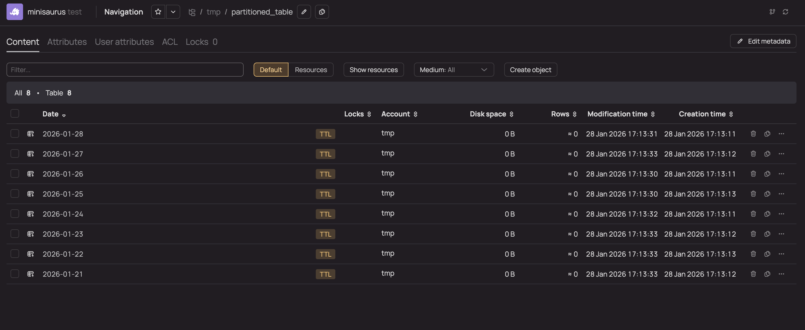
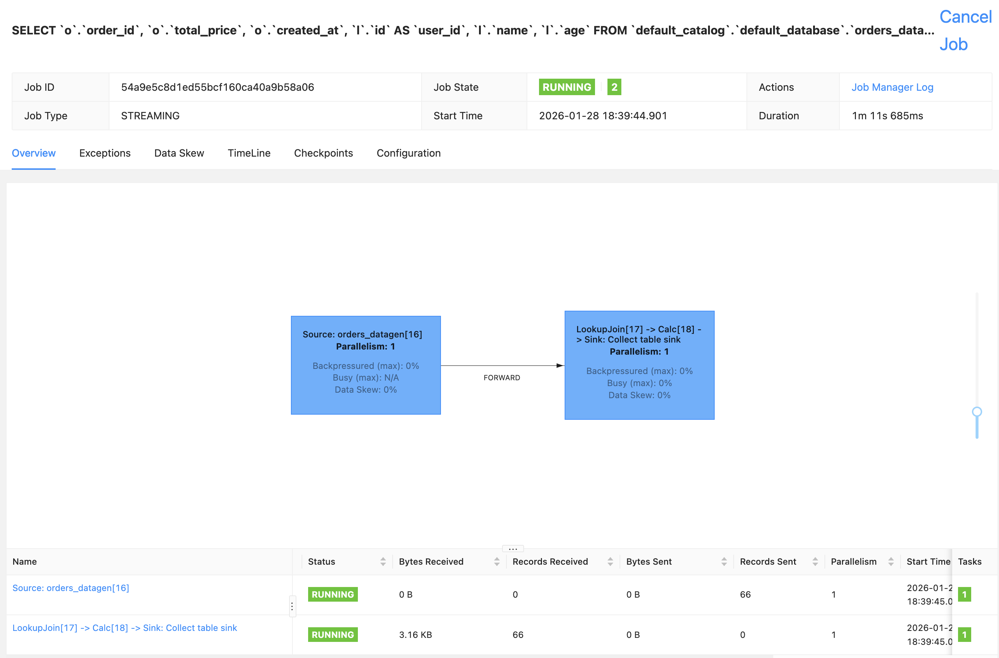

# Apache Flink YTsaurus Connector

This project contains the Apache Flink Connector for working with [YTsaurus Sorted Dynamic Tables](https://ytsaurus.tech/docs/en/user-guide/dynamic-tables/sorted-dynamic-tables).

## Table of Contents

- [Overview](#overview)
- [Supported Flink APIs](#supported-flink-apis)
- [Features](#features)
- [Supported Flink Versions](#supported-flink-versions)
- [Building from Source](#building-from-source)
- [Quick Start Guide](#quick-start-guide)
- [Configuration Options](#configuration-options)
- [Authentication](#authentication)
- [Data Partitioning](#data-partitioning)
- [Table Resharding](#table-resharding)
- [Lookup Operations](#lookup-operations)
- [Examples](#examples)

## Overview

The Apache Flink YTsaurus Connector enables seamless integration between Apache Flink and YTsaurus sorted dynamic tables. It provides both source and sink capabilities with advanced features like automatic table creation, data partitioning, lookup operations with caching, and multi-cluster support.

## Supported Flink APIs

- **Stream API** - Data writing is supported
- **Table API/SQL** - Bounded stream reading, writing, and lookup operations are supported

## Features

- **Writing to YTsaurus dynamic tables** - Full support for data ingestion
- **Automatic table creation** - Tables are created automatically before writing if they don't exist
- **Advanced table sharding** - Configurable resharding strategies for optimal performance
- **Data partitioning** - Support for various partitioning granularities (hour, day, week, month, year)
- **External lock service support** - Coordination with external locking mechanisms
- **Sync/async lookup operations** - Both synchronous and asynchronous lookup in YTsaurus dynamic tables
- **Lookup caching** - Support for `FULL` and `PARTIAL` cache modes to optimize lookup performance
- **Multi-cluster Lookup support** - Ability to lookup in multiple YTsaurus clusters
- **Trackable fields** - Support for tracking field value via metrics

## Supported Flink Versions

The connector officially supports Apache Flink version `1.20.X`, but compatibility with other, earlier versions is not excluded.

## Installation

Maven

```xml
<dependency>
    <groupId>tech.ytsaurus.flyt.connectors.ytsaurus</groupId>
    <artifactId>flink-connector-ytsaurus</artifactId>
    <version>1.10.0</version>
    <classifier>all</classifier>
</dependency>
```

Gradle

```kotlin
implementation("tech.ytsaurus.flyt.connectors.ytsaurus:flink-connector-ytsaurus:1.10.0:all")
```

## Building from Source

### Prerequisites

- Git
- Gradle 8.x (we recommend 8.14.3)
- Java 11

### Build Steps

```bash
git clone https://github.com/ytsaurus/ytsaurus-flyt.git
cd ytsaurus-flyt
./gradlew shadowJar -p flink-connector-ytsaurus

# To see the assembled artifact
ls flink-connector-ytsaurus/build/libs
```

## Quick Start Guide

### Step 1 - Installing YTsaurus

Install a YTsaurus cluster to connect to. This step can be skipped if you already have a cluster configured.

For local development and testing, we recommend using the official documentation to [install the YTsaurus cluster via Kind](https://ytsaurus.tech/docs/en/overview/try-yt?tabs=defaultTabsGroup-5fe2y4hn_kind_dropdown). For production deployments, please follow the [YTsaurus Admin Guide](https://ytsaurus.tech/docs/en/admin-guide/install-ytsaurus).

> [!NOTE]
> The flink-connector-ytsaurus uses a [Java YTsaurus client](https://ytsaurus.tech/docs/en/api/java/examples) that uses RPC proxy.

### Step 2 - Installing Apache Flink cluster

Install Apache Flink cluster using the [official documentation](https://nightlies.apache.org/flink/flink-docs-release-1.20/docs/try-flink/local_installation/#downloading-flink) and check [Supported Flink Version](#supported-flink-versions).

### Step 3 - Install Flink Connector YTsaurus to Apache Flink cluster

Build the connector from source code (see [Building from Source](#building-from-source)). After assembling the connector, place the resulting jar file in the directory `{$FLINK_ROOT}/lib`.

### Step 4 - Change Flink Web UI port

Open the `conf/config.yaml` file and change the `rest.port` parameter from `8081` to `8083` to avoid port conflicts with YTsaurus.

### Step 5 - Start Apache Flink Cluster with Flink SQL Client

Start Apache Flink cluster:
```bash
./bin/start-cluster.sh
```

Start Flink SQL Client:
```bash
./bin/sql-client.sh
```

### Step 6 - Run Demo Job

1) Create Datagen source:

```sql
CREATE TABLE simple_datagen_source (
    id BIGINT,
    name STRING,
    age INT,
    salary DOUBLE,
    is_active BOOLEAN,
    created_at TIMESTAMP(3)
) WITH (
    'connector' = 'datagen',
    'rows-per-second' = '50',
    'number-of-rows' = '1000',
    'fields.id.kind' = 'sequence',
    'fields.id.start' = '1',
    'fields.id.end' = '100000',
    'fields.name.length' = '20',
    'fields.age.min' = '22',
    'fields.age.max' = '65',
    'fields.salary.min' = '30000.0',
    'fields.salary.max' = '150000.0'
);
```

2) Create YTsaurus sink:

```sql
CREATE TABLE ytsaurus_simple_sink (
    id BIGINT,
    name STRING,
    age INT,
    salary DOUBLE,
    is_active BOOLEAN,
    created_at TIMESTAMP(3),
    updated_at TIMESTAMP(3),
    PRIMARY KEY (id) NOT ENFORCED
) WITH (
    'connector' = 'ytsaurus',
    'proxy' = 'localhost:8081',
    'path' = '//tmp/flink_simple_test_table',
    'credentials-source' = 'options',
    'username' = 'admin',
    'token' = 'password',
    'schema' = '[
        {"name"="id";"type"="int64";"required"=%false;"sort_order"="ascending"};
        {"name"="name";"type"="string";"required"=%false};
        {"name"="age";"type"="int64";"required"=%false};
        {"name"="salary";"type"="double";"required"=%false};
        {"name"="is_active";"type"="boolean";"required"=%false};
        {"name"="created_at";"type"="string";"required"=%false};
        {"name"="updated_at";"type"="string";"required"=%false}
    ]'
);
```

3) Run job that writes generated data to YTsaurus dynamic table:

```sql
INSERT INTO ytsaurus_simple_sink
SELECT
    id,
    name,
    age,
    salary,
    is_active,
    created_at,
    CURRENT_TIMESTAMP AS updated_at
FROM simple_datagen_source;
```

4) Monitor job progress at [localhost:8083](http://localhost:8083)


5) The table `flink_simple_test_table` will be created in the `/tmp/flink_simple_test_table` directory containing the results of the Flink job.


Congratulations! You've launched your first job with YTsaurus and Apache Flink.

## Configuration Options

The YTsaurus connector supports a wide range of configuration options to customize its behavior.

### Required Options

| Option | Type | Description|
|--------|------|------------|
| `proxy` | String | YTsaurus HTTP proxy address|
| `schema` | String | YSON schema definition for the YTsaurus table|
| `credentials-source` | String | Authentication method (`options`, `env`, `your-custom-provider`) |

### Path Configuration

| Option | Type | Default | Description|
|--------|------|---------|------------|
| `path` | String | - | Path to the YTsaurus table|
| `path-map` | Map<String, String> | - | Map of cluster-to-table-path for multi-cluster lookups |

### Authentication Options

| Option | Type | Default | Description |
|--------|------|---------|-------------|
| `username` | String | - | YTsaurus username (when using `options` credentials source) |
| `token` | String | - | YTsaurus token (when using `options` credentials source) |

### Table Configuration

| Option | Type | Default | Description |
|--------|------|---------|-------------|
| `optimize-for` | Enum | - | Table optimization mode (`LOOKUP`, `SCAN`) |
| `primary-medium` | Enum | - | Primary storage medium (`DEFAULT`, `SSD_BLOBS`) |
| `tablet-cell-bundle` | String | - | Tablet cell bundle name |
| `enable-dynamic-store-read` | Boolean | `true` | Enable dynamic store read attribute |
| `custom-attributes` | String | - | Custom table attributes in YSON format |

### Partitioning Options

| Option | Type | Default | Description |
|--------|------|---------|-------------|
| `partition-key` | String | - | Column name to use for partitioning |
| `partition-scale` | Enum | - | Partitioning granularity (`HOUR`, `HOUR_T`, `DAY`, `WEEK`, `MONTH`, `SHORT_MONTH`, `YEAR`, `SHORT_YEAR`) |
| `partition-ttl-day-cnt` | Integer | - | Number of days to keep partitions |
| `partition-ttl-in-days-from-creation` | Integer | - | TTL in days from partition creation |
| `min-partition-ttl` | Integer | `20` | Minimum partition TTL in days |

### Resharding Options

| Option | Type | Default | Description|
|--------|------|---------|------------|
| `reshard.strategy` | Enum | `NONE` | Resharding strategy (`NONE`, `FIXED`, `LAST_PARTITIONS`) |
| `reshard.tablet-count` | Integer | - | Number of tablets for resharding|
| `reshard.uniform` | Boolean | `false` | Use uniform partitioning|
| `reshard.last-partitions-count` | Integer | `7` | Number of partitions to consider in `LAST_PARTITIONS` strategy |

### Transaction and Performance Options

| Option | Type | Default | Description |
|--------|------|---------|-------------|
| `commit-transaction-period` | Duration | - | Period for committing transactions |
| `transaction-timeout` | Duration | - | Transaction timeout |
| `transaction-atomicity` | Enum | - | Transaction atomicity level |
| `rows-in-transaction-limit` | Integer | - | Maximum rows per transaction |
| `rows-in-modification-limit` | Integer | - | Maximum rows per modification |
| `retry-strategy` | Enum | `EXPONENTIAL` | Retry strategy (`EXPONENTIAL`, `NO_RETRY`) |

### Lookup Options

| Option | Type | Default | Description                                                                                                                                                           |
|--------|------|---------|-----------------------------------------------------------------------------------------------------------------------------------------------------------------------|
| `lookup.async` | Boolean | `false` | Enable asynchronous lookup                                                                                                                                            |
| `lookup-method` | Enum | `LOOKUP` | Lookup method (`LOOKUP`, `SELECT`). `LOOKUP` method works only with key columns, but has better performance. `SELECT` method works with any colums, but works slowly. |
| `cluster-pick-strategy` | String | `FirstAvailableClusterPickStrategy` | Strategy for picking clusters in multi-cluster setup. You can choose your own implementation of the strategy.                                                         |

### Cache Options for lookup

| Option | Type | Default | Description |
|--------|------|---------|-------------|
| `lookup.cache` | Enum | `NONE` | Cache type (`NONE`, `PARTIAL`, `FULL`) |
| `lookup.partial-cache.max-rows` | Long | - | Maximum rows in partial cache |
| `lookup.partial-cache.expire-after-write` | Duration | - | Cache expiration after write |
| `lookup.partial-cache.expire-after-access` | Duration | - | Cache expiration after access |
| `lookup.partial-cache.cache-missing-key` | Boolean | - | Cache missing keys |
| `lookup.full-cache.reload-strategy` | Enum | - | Full cache reload strategy (`PERIODIC`, `TIMED`) |
| `lookup.full-cache.periodic-reload-interval` | Duration | - | Periodic reload interval |
| `lookup.full-cache.timed-reload-iso-time` | String | - | Timed reload ISO time |

### Other Options

| Option | Type | Default | Description                  |
|--------|------|---------|------------------------------|
| `trackable-field` | String | - | Field name for tracking value |
| `proxy-role` | String | - | Set proxy-role       |

## Schema Definition

YTsaurus tables require a YSON schema definition. The schema must be provided as a YSON list with column definitions.

### Schema Format

```yson
[
    {"name"="column_name";"type"="data_type";"required"=%false;"sort_order"="ascending"};
    {"name"="another_column";"type"="string";"required"=%false}
]
```

For more information about YTsaurus schemas, see the [official documentation](https://ytsaurus.tech/docs/en/user-guide/storage/static-schema).


## Authentication

The connector supports multiple authentication methods:

### Options-based Authentication

Credentials are provided directly in the table configuration:

```sql
'credentials-source' = 'options',
'username' = 'your-username',
'token' = 'your-token'
```

### Environment-based Authentication

Credentials are read from environment variables:

```sql
'credentials-source' = 'env'
```

Set the following environment variables:
- `YT_USER` - YTsaurus username
- `YT_TOKEN` - YTsaurus token

### Custom Authentication

To create your own authentication method, implement the interface [`CredentialsProvider`](src/main/java/tech/ytsaurus/flyt/connectors/ytsaurus/common/credentials/CredentialsProvider.java) interface.

## Data Partitioning

The connector supports automatic data partitioning based on timestamp fields with various granularity:

### Supported Partition Scales

- `HOUR` - Hourly partitions (format: `YYYY-MM-DD HH:00:00`)
- `HOUR_T` - Hourly partitions with T separator (format: `YYYY-MM-DDTHH:00:00`)
- `DAY` - Daily partitions (format: `YYYY-MM-DD`)
- `WEEK` - Weekly partitions (format: `YYYY-MM-DD` with day of monday)
- `MONTH` - Monthly partitions (format: `YYYY-MM-01`)
- `SHORT_MONTH` - Short monthly partitions (format: `YYYY-MM`)
- `YEAR` - Yearly partitions (format: `YYYY-MM`)
- `SHORT_YEAR` - Short yearly partitions (format: `YYYY`)

### Partitioning Example

```sql
CREATE TABLE partitioned_data_source (
id BIGINT,
data STRING,
event_time TIMESTAMP(3)
) WITH (
'connector' = 'datagen',
'rows-per-second' = '50',
'number-of-rows' = '1000',
'fields.id.kind' = 'sequence',
'fields.id.start' = '1',
'fields.id.end' = '100000',
'fields.data.length' = '20',
'fields.event_time.max-past' = '7d'
);
```

```sql
CREATE TABLE partitioned_table (
    id BIGINT,
    data STRING,
    event_time TIMESTAMP(3),
    PRIMARY KEY (id) NOT ENFORCED
) WITH (
    'connector' = 'ytsaurus',
    'proxy' = 'localhost:8081',
    'credentials-source' = 'options',
    'username' = 'admin',
    'token' = 'password',
    'path' = '//tmp/partitioned_table',
    'partition-key' = 'event_time',
    'partition-scale' = 'DAY',
    'partition-ttl-day-cnt' = '30',
    'schema' = '[
        {"name"="id";"type"="int64";"required"=%false;"sort_order"="ascending"};
        {"name"="data";"type"="string";"required"=%false};
        {"name"="event_time";"type"="string";"required"=%false}
    ]'
);
```

```sql
INSERT INTO partitioned_table
SELECT *
FROM partitioned_data_source;
```

Check result.



## Table Resharding

The connector supports automatic table resharding to optimize performance:

### Resharding Strategies

- **`NONE`** - Disable resharding
- **`FIXED`** - Resharding with a fixed number of tablets
- **`LAST_PARTITIONS`** - Resharding based on the average number of tablets in the last N partitions

### Resharding Example

```sql
'reshard.strategy' = 'FIXED',
'reshard.tablet-count' = '10',
'reshard.uniform' = 'true'
```

## Lookup Operations

The connector supports both synchronous and asynchronous lookup operations with caching capabilities.

### Lookup Methods

- **`LOOKUP`** - Standard lookup operation
- **`SELECT`** - SELECT-based lookup operation

### Cache Types

- **`NONE`** - No caching
- **`PARTIAL`** - Partial caching with configurable size and TTL
- **`FULL`** - Full table caching with periodic or timed reload

### Lookup Example

The lookup connector requires a yson formatter. Build the yson formatter according to the [docs](../flink-yson/README.md) and put it in `$FLINK_ROOT/lib`.

Prepare data to lookup operation.

```sql
CREATE TABLE users_datagen (
    id BIGINT,
    name STRING,
    age INT,
    created_at TIMESTAMP(3)
) WITH (
    'connector' = 'datagen',
    'rows-per-second' = '50',
    'number-of-rows' = '1000',
    'fields.id.kind' = 'sequence',
    'fields.id.start' = '1',
    'fields.id.end' = '1000'
);
```

```sql
CREATE TABLE lookup_table_sink (
    id BIGINT,
    name STRING,
    age INT,
    created_at TIMESTAMP(3),
    PRIMARY KEY (id) NOT ENFORCED
) WITH (
    'connector' = 'ytsaurus',
    'proxy' = 'localhost:8081',
    'path' = '//tmp/lookup_table',
    'credentials-source' = 'options',
    'username' = 'admin',
    'token' = 'password',
    'schema' = '[
        {"name"="id";"type"="int64";"required"=%false;"sort_order"="ascending"};
        {"name"="name";"type"="string";"required"=%false};
        {"name"="age";"type"="int64";"required"=%false};
        {"name"="created_at";"type"="string";"required"=%false}
    ]'
);
```

```sql
INSERT INTO lookup_table_sink
SELECT
    id,
    name,
    age,
    created_at
FROM users_datagen;
```

Join order data with users data

```sql
CREATE TABLE orders_datagen (
    order_id BIGINT,
    user_id BIGINT,
    total_price INT,
    created_at TIMESTAMP(3),
    proc_time AS PROCTIME()
) WITH (
    'connector' = 'datagen',
    'rows-per-second' = '1',
    'number-of-rows' = '100',
    'fields.user_id.min' = '1',
    'fields.user_id.max' = '1000',
    'fields.total_price.min' = '1',
    'fields.total_price.max' = '10000'
);
```

```sql
CREATE TABLE lookup_table (
    id BIGINT,
    name STRING,
    age INT,
    PRIMARY KEY (id) NOT ENFORCED
) WITH (
    'connector' = 'ytsaurus',
    'format' = 'yson',
    'proxy' = 'localhost:8081',
    'credentials-source' = 'options',
    'username' = 'admin',
    'token' = 'password',
    'path' = '//tmp/lookup_table',
    'lookup.async' = 'true',
    'lookup.cache' = 'PARTIAL',
    'lookup.partial-cache.max-rows' = '10000',
    'lookup.partial-cache.expire-after-access' = '1h',
    'lookup-method' = 'LOOKUP',
    'schema' = '[
        {"name"="id";"type"="int64";"required"=%false;"sort_order"="ascending"};
        {"name"="name";"type"="string";"required"=%false}
    ]'
);
```

```sql
SELECT 
    o.order_id,
    o.total_price,
    o.created_at,
    l.id as user_id,
    l.name,
    l.age 
FROM orders_datagen o
LEFT JOIN lookup_table FOR SYSTEM_TIME AS OF o.proc_time AS l 
ON o.user_id = l.id;
```

Check Apache Flink UI [localhost:8083](http://localhost:8083).



The Flink SQL Client will display the result of lookups the data in real time.


## Examples

### Basic Sink Example

```sql
CREATE TABLE ytsaurus_sink (
    user_id BIGINT,
    username STRING,
    email STRING,
    created_at TIMESTAMP(3),
    PRIMARY KEY (user_id) NOT ENFORCED
) WITH (
    'connector' = 'ytsaurus',
    'proxy' = 'localhost:8081',
    'path' = '//home/your-user/users_table',
    'credentials-source' = 'options',
    'username' = 'your-username',
    'token' = 'your-token',
    'schema' = '[
        {"name"="user_id";"type"="int64";"required"=%false;"sort_order"="ascending"};
        {"name"="username";"type"="string";"required"=%false};
        {"name"="email";"type"="string";"required"=%false};
        {"name"="created_at";"type"="string";"required"=%false}
    ]'
);
```

### Partitioned Table with Resharding

```sql
CREATE TABLE events_table (
    event_id BIGINT,
    user_id BIGINT,
    event_type STRING,
    event_data STRING,
    event_time TIMESTAMP(3),
    PRIMARY KEY (event_id) NOT ENFORCED
) WITH (
    'connector' = 'ytsaurus',
    'proxy' = 'localhost:8081',
    'path' = '//home/your-user/events',
    'credentials-source' = 'options',
    'username' = 'your-username',
    'token' = 'your-token',
    'partition-key' = 'event_time',
    'partition-scale' = 'DAY',
    'partition-ttl-day-cnt' = '90',
    'reshard.strategy' = 'LAST_PARTITIONS',
    'reshard.tablet-count' = '20',
    'reshard.last-partitions-count' = '7',
    'reshard.uniform' = 'true',
    'optimize-for' = 'SCAN',
    'schema' = '[
        {"name"="event_id";"type"="int64";"required"=%false;"sort_order"="ascending"};
        {"name"="user_id";"type"="int64";"required"=%false};
        {"name"="event_type";"type"="string";"required"=%false};
        {"name"="event_data";"type"="string";"required"=%false};
        {"name"="event_time";"type"="string";"required"=%false}
    ]'
);
```

### Lookup Table with Full Cache

```sql
CREATE TABLE user_lookup (
    user_id BIGINT,
    username STRING,
    email STRING,
    PRIMARY KEY (user_id) NOT ENFORCED
) WITH (
    'connector' = 'ytsaurus',
    'proxy' = 'localhost:8081',
    'path' = '//home/your-user/users',
    'credentials-source' = 'options',
    'username' = 'your-username',
    'token' = 'your-token',
    'lookup.cache' = 'FULL',
    'lookup.full-cache.reload-strategy' = 'PERIODIC',
    'lookup.full-cache.periodic-reload-interval' = '1h',
    'optimize-for' = 'LOOKUP',
    'schema' = '[
        {"name"="user_id";"type"="int64";"required"=%false;"sort_order"="ascending"};
        {"name"="username";"type"="string";"required"=%false};
        {"name"="email";"type"="string";"required"=%false}
    ]'
);
```

### Multi-cluster Configuration

```sql
CREATE TABLE multi_cluster_table (
    id BIGINT,
    data STRING,
    PRIMARY KEY (id) NOT ENFORCED
) WITH (
    'connector' = 'ytsaurus',
    'proxy' = 'localhost:8081',
    'path-map' = 'cluster1://tmp/table1,cluster2://tmp/table2',
    'cluster-pick-strategy' = 'FirstAvailableClusterPickStrategy',
    'credentials-source' = 'options',
    'username' = 'your-username',
    'token' = 'your-token',
    'schema' = '[
        {"name"="id";"type"="int64";"required"=%false;"sort_order"="ascending"};
        {"name"="data";"type"="string";"required"=%false}
    ]'
);
```

## Contributing

Contributions are welcome! Please see the [CONTRIBUTING.md](../CONTRIBUTING.md) file for guidelines.

## License

This project is licensed under the Apache License 2.0. See the [LICENSE](../LICENSE) file for details.