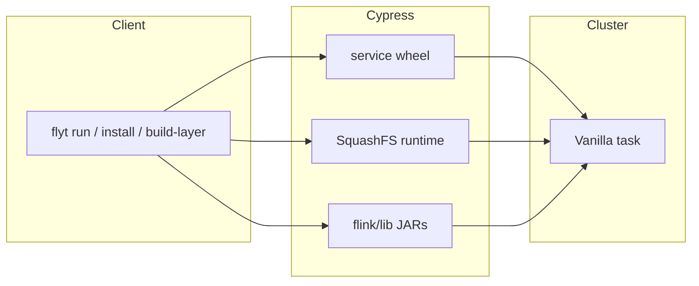
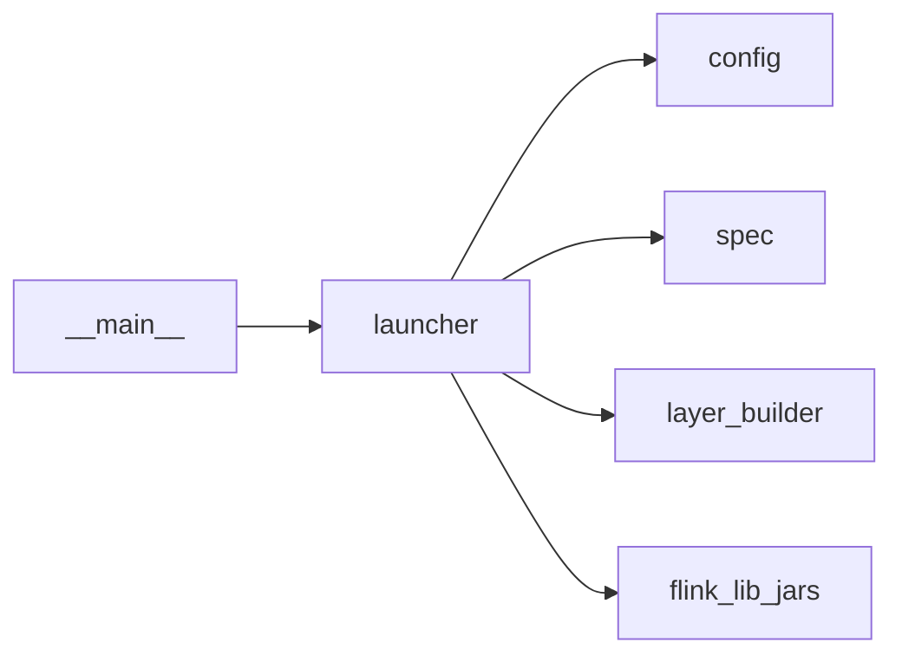

# Architecture

FLYT submits a PyFlink job as a YTsaurus Vanilla operation (right now, application mode only). The process builds an [operation spec](https://ytsaurus.tech/docs/ru/user-guide/data-processing/operations/vanilla#primer-specifikacii), uploads job wheels and JARs, and submits it via the YTsaurus client.

Profiles encapsulate cluster proxy/pool, paths, layers, etc. See [FlytConfig](src/ytsaurus_flyt/config.py).

The SquashFS runtime is built where you run `flyt` (Docker/Podman + `mksquashfs`), keyed by hash and cached on Cypress so exec nodes do not run `pip` per job. 

Delivery: `layer_paths` - for production clusters - (mount SquashFS on the node) or `sandbox_unpack` - for local (kind) cluster where porto support is not available - (upload `.squashfs` as a file and unpack in the sandbox). 

Wheels in the layer target `runtime_python_version`; `python_bin` on workers must match that ABI.

JARs: list basenames in `embed_squashfs_layer_jar_basenames` (inside the layer) and/or `runtime_jar_basenames` (staged as `file_paths` to `flink/lib`). Resolution picks the latest semver per basename under `jar_scan_folder`.

The code is split so the CLI, YTsaurus submission, and layer/image build logic can be tested independently. Job bootstrap is concatenated bash from `run_scripts/`.

