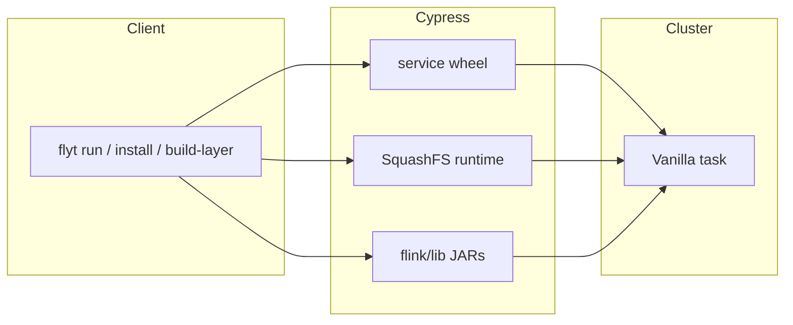
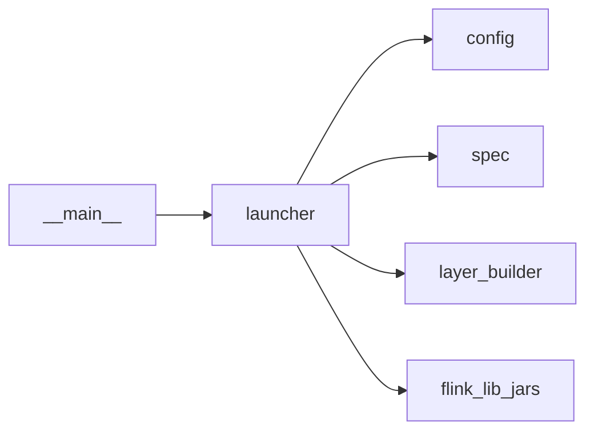

# Architecture

**FLYT** turns a PyFlink job into a YTsaurus **Vanilla** operation in **application mode**. The launcher does not fork Flink: it gathers artifacts, builds a spec, submits. Settings live in `FlytConfig`, loaded from named **profiles** under `~/.config/flyt/profiles/<name>.yaml` (or `FLYT_CONFIG_DIR`). Use `flyt profile add` or edit those files.

**Cypress layout (defaults):** `flyt profile add` sets `cypress_base_path` to `//home/flyt/clusters/<profile_name>/` so SquashFS caches resolve to `.../layers` and `.../tools` under that cluster prefix. Shared JARs for `flink/lib` can live at **`//home/flyt/libraries/`** with `jar_scan_folder` pointing at that directory.

**Approach:** ship Python and Flink as **one SquashFS runtime** built on the client and cached on Cypress by hash, instead of running `pip` on every job. Delivery is either **`layer_paths`** (mount SquashFS on the exec node) or **`sandbox_unpack`** (ship `.squashfs` as `file_paths` and unpack in the job sandbox). Wheels in the layer are built for `runtime_python_version`; `python_bin` on exec nodes must be that same interpreter (ABI), or imports like grpc break.

**Flink lib JARs:** list basenames under **`embed_squashfs_layer_jar_basenames`** (layer) and/or **`runtime_jar_basenames`** (as `file_paths` to `flink/lib`). Latest semver per basename from **`jar_scan_folder`**. Only listed basenames are fetched.

**Modules:** the CLI calls `launcher`, which uses `spec`, `flink_lib_jars`, `layer_builder`, `wheel_utils`, `profiles`, and `validate_config` (`flyt validate`). The job script is built from **bash snippets** under `run_scripts/`.

Those JARs are resolved from Cypress; the Python side uploads and wires them into the layer or `file_paths`.
