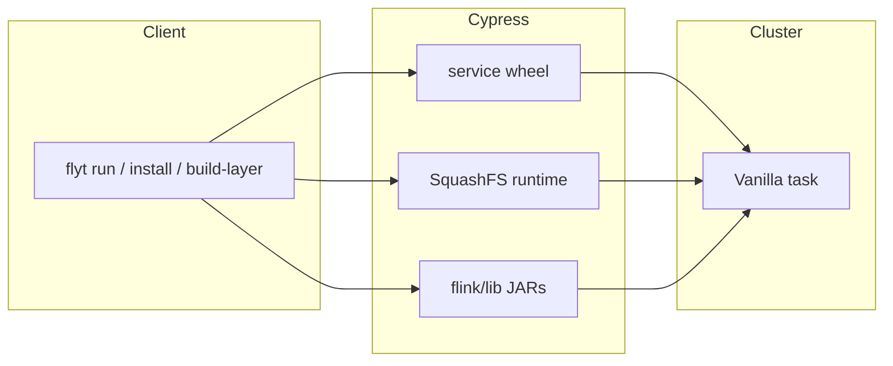
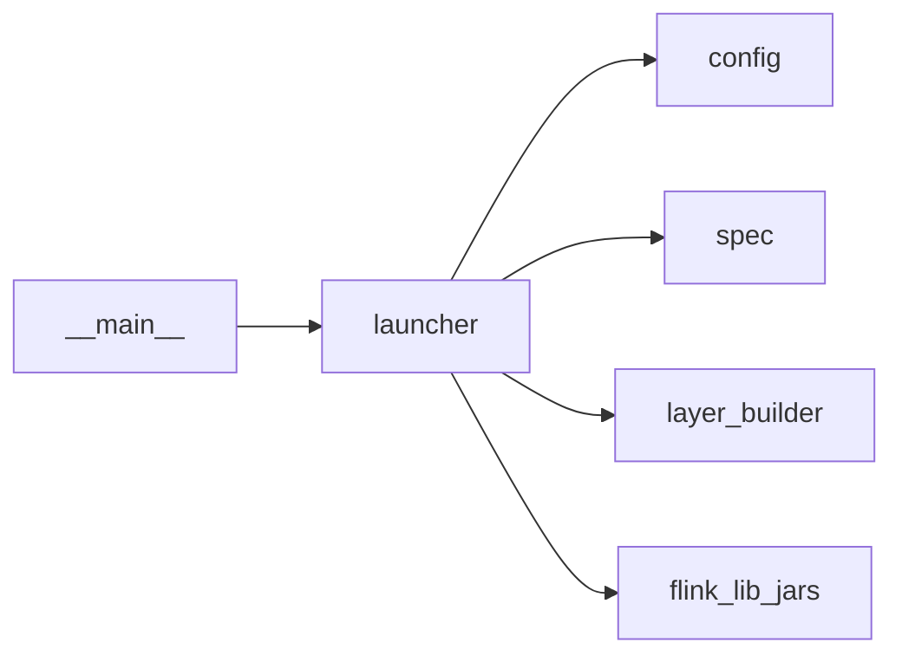

# Architecture

FLYT submits a PyFlink job as a YTsaurus Vanilla operation (application mode). The process builds a spec, uploads wheels/runtime/JARs, and submits it via the YTsaurus client; it does not run a local Flink cluster. Configuration is `FlytConfig`, usually from profiles in `~/.config/flyt/profiles/<name>.yaml` (or `FLYT_CONFIG_DIR`).

By default `flyt profile add` sets `cypress_base_path` to `//home/flyt/clusters/<profile_name>/` so layer/tool caches live under that prefix. Optional shared JARs for `flink/lib` can sit under e.g. `//home/flyt/libraries/` with `jar_scan_folder` pointing there.

The SquashFS runtime is built where you run `flyt` (Docker/Podman + `mksquashfs`), keyed by hash and cached on Cypress so exec nodes do not run `pip` per job. Delivery: `layer_paths` (mount SquashFS on the node) or `sandbox_unpack` (upload `.squashfs` as a file and unpack in the sandbox). Wheels in the layer target `runtime_python_version`; `python_bin` on workers must match that ABI.

JARs: list basenames in `embed_squashfs_layer_jar_basenames` (inside the layer) and/or `runtime_jar_basenames` (staged as `file_paths` to `flink/lib`). Resolution picks the latest semver per basename under `jar_scan_folder`.

The code is split so the CLI, YTsaurus submission, and layer/image build logic can be tested independently. Job bootstrap is concatenated bash from `run_scripts/`.

