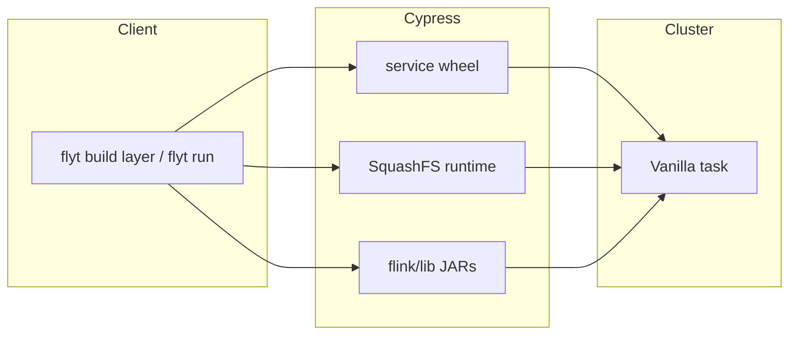
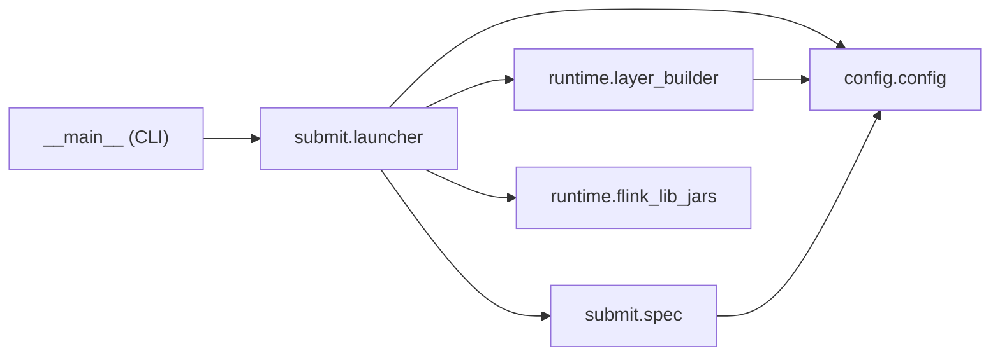

# Architecture

FLYT submits a PyFlink job as a YTsaurus Vanilla operation (right now, application mode only). The process builds an [operation spec](https://ytsaurus.tech/docs/ru/user-guide/data-processing/operations/vanilla#primer-specifikacii), uploads job wheels and JARs, and submits it via the YTsaurus client.

Profiles encapsulate cluster proxy/pool, paths, layers, etc. See [FlytConfig](src/ytsaurus_flyt/config/config.py).

The SquashFS runtime is built where you run `flyt` (Docker/Podman; host `mksquashfs` is used if present, else packed inside a container) with `flyt build layer`, then referenced explicitly via `squashfs_layer_paths` — `flyt run` never builds one. Wheel downloads and the bundled-CPython install are cached locally under `~/.cache/flyt` (override with `FLYT_CACHE_DIR`), so repeat builds skip re-downloading. 

Delivery: [`layer_paths`](https://ytsaurus.tech/docs/en/user-guide/data-processing/operations/operations-options#user-script-options) — for production clusters (mount SquashFS on the node) — or `sandbox_unpack` — for local (Kind) clusters where porto support is not available (upload `.squashfs` as a file and unpack in the sandbox). 

The layer is self-contained: it bundles a relocatable CPython (`runtime_python_version`, installed via [`uv python install`](https://docs.astral.sh/uv/concepts/python-versions/)) and a Temurin JRE (`java_version`, copied out of the official `eclipse-temurin:<N>-jre` image). pyflink wheels target that CPython, and the run script points `PYTHON_BIN`/`JAVA_HOME` at the bundled runtimes — so jobs don't depend on the exec node's Python/JDK.

```mermaid
flowchart LR
    subgraph Client
        A[flyt build layer / flyt run]
    end
    subgraph Cypress
        W[service wheel]
        R[SquashFS runtime]
        J[flink/lib JARs]
    end
    subgraph Cluster
        V[Vanilla task]
    end
    A --> W & R & J
    W & R & J --> V
```

JARs: list basenames in `runtime_jar_basenames`; they are resolved from `jar_scan_folder` (latest semver per basename) and staged as [`file_paths`](https://ytsaurus.tech/docs/en/user-guide/data-processing/operations/operations-options#user-script-options) into `flink/lib` at runtime. JARs are never embedded in the runtime layer, so the layer stays a canonical `flink × python` artifact.

The code is split so the CLI, YTsaurus submission, and layer/image build logic can be tested independently. Job bootstrap is concatenated bash from `run_scripts/`.

## Package layout

`src/ytsaurus_flyt/` groups modules by responsibility (the public API in `__init__.py` is stable regardless of where internals live):

| Subpackage  | Responsibility                              | Modules                                                                            |
|-------------|---------------------------------------------|------------------------------------------------------------------------------------|
| `config/`   | Domain model & configuration                | `config` (`FlytConfig`), `models` (presets/params), `profiles`, `validate_config`  |
| `runtime/`  | Build the runtime that ships to the cluster | `container_runtime`, `wheel_utils`, `jar_utils`, `flink_lib_jars`, `layer_builder` |
| `submit/`   | Build the spec and submit to YTsaurus       | `yt_client`, `credentials`, `spec`, `launcher`                                     |
| `tracking/` | Introspect a running job                    | `ui_tracker`, `jobshell_resolve`                                                   |
| (root)      | Entry points & public surface               | `__init__` (public API), `__main__` (Click CLI), `cli_helpers`                     |

Dependencies flow one way: `config` is the leaf; `runtime`/`submit` depend on `config`; `__main__` depends on everything. `run_scripts/*.sh` (job bootstrap) ships as package data at the package root.

```mermaid
graph LR
    m["__main__ (CLI)"] --> L["submit.launcher"]
    L --> cfg["config.config"]
    L --> sp["submit.spec"]
    L --> lb["runtime.layer_builder"]
    L --> jlib["runtime.flink_lib_jars"]
    lb --> cfg
    sp --> cfg
```
