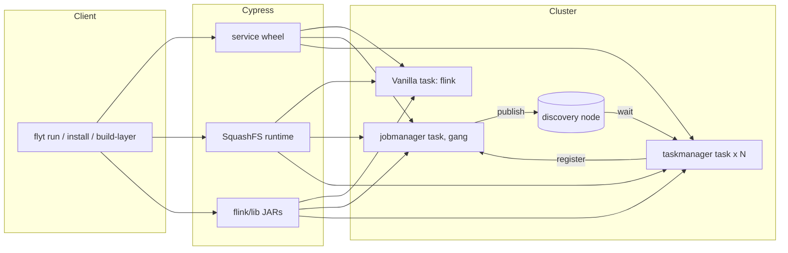
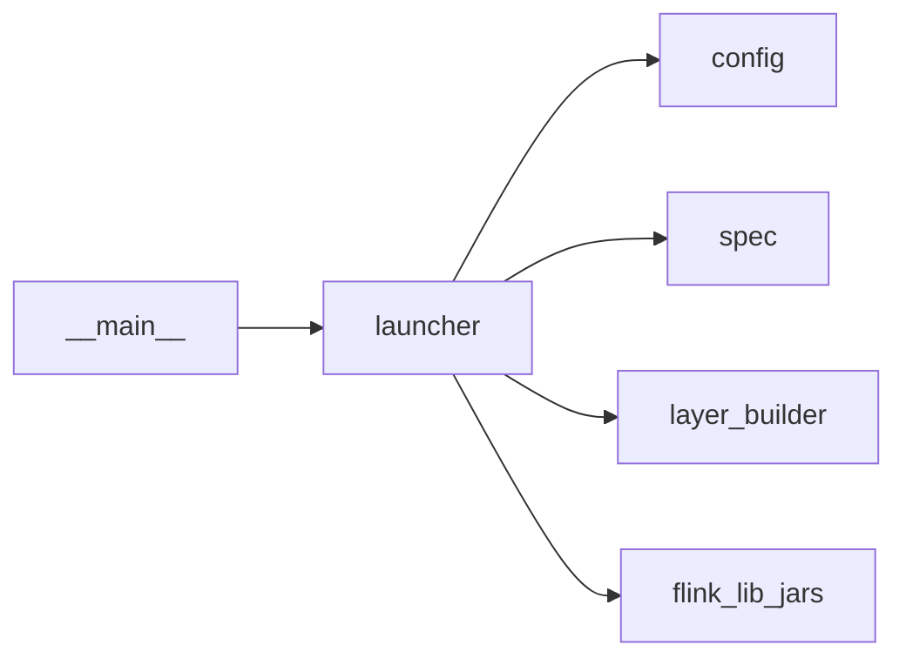

# Architecture

FLYT submits a PyFlink job as a YTsaurus Vanilla operation: one operation per pipeline, no shared cluster. The process builds an [operation spec](https://ytsaurus.tech/docs/ru/user-guide/data-processing/operations/vanilla#primer-specifikacii), uploads job wheels and JARs, and submits it via the YTsaurus client.

Two topologies (`FlytConfig.cluster_mode`):

* `minicluster`: a single `flink` task; the job runs `python <script>` and PyFlink starts an in-JVM MiniCluster. Heap comes from `FLINK_ENV_JAVA_OPTS`, the task uses `restart_completed_jobs` so a pipeline that exits 0 is re-run.
* `application`: a `jobmanager` task (one job, `gang_options`) and a `taskmanager` task (`taskmanager_count` jobs). The JobManager job runs `standalone-job.sh --job-classname org.apache.flink.client.python.PythonDriver -py <script>`, i.e. Flink application mode; memory and ports are passed as `-D` options from `spec.flink_dynamic_properties`. Gang tasks cannot use `restart_completed_jobs`, so the JobManager script re-runs the driver in place on exit 0 (or calls `complete_operation` when `restart_completed_jobs` is false); a non-zero exit fails the gang job and YT restarts every job with a new incarnation. TaskManagers are not gang jobs: YT restarts a failed one alone and Flink's restart strategy recovers the job.

Discovery in application mode lives in Cypress: `run_scripts/flyt_job_helper.py` (stdlib only, talks to the HTTP proxy from `FLYT_YT_PROXY`) publishes `{host, rpc_port, rest_port, incarnation}` under `discovery_path_prefix/<operation_id>`, keeps it alive with a heartbeat that bumps `expiration_time`, and removes it on a clean exit. TaskManagers poll the record, require a matching `YT_OPERATION_INCARNATION`, probe the REST port, then `exec taskmanager.sh`.

Profiles encapsulate cluster proxy/pool, paths, layers, etc. See [FlytConfig](src/ytsaurus_flyt/config.py).

The SquashFS runtime is built where you run `flyt` (Docker/Podman + `mksquashfs`), keyed by hash and cached on Cypress so exec nodes do not run `pip` per job. 

Delivery: [`layer_paths`](https://ytsaurus.tech/docs/en/user-guide/data-processing/operations/operations-options#user-script-options) — for production clusters (mount SquashFS on the node) — or `sandbox_unpack` — for local (Kind) clusters where porto support is not available (upload `.squashfs` as a file and unpack in the sandbox). 

Wheels in the layer target `runtime_python_version`; `python_bin` on workers must match that ABI.

```mermaid
flowchart LR
    subgraph Client
        A[flyt run / install / build-layer]
    end
    subgraph Cypress
        W[service wheel]
        R[SquashFS runtime]
        J[flink/lib JARs]
    end
    subgraph Cluster
        V[Vanilla task: flink]
        JM[jobmanager task, gang]
        TM[taskmanager task x N]
        D[(discovery node)]
    end
    A --> W & R & J
    W & R & J --> V
    W & R & J --> JM & TM
    JM -- publish --> D
    D -- wait --> TM
    TM -- register --> JM
```

`minicluster` uses only the `flink` task; `application` uses `jobmanager` + `taskmanager`.

JARs: list basenames in `embed_squashfs_layer_jar_basenames` (inside the layer) and/or `runtime_jar_basenames` (staged as [`file_paths`](https://ytsaurus.tech/docs/en/user-guide/data-processing/operations/operations-options#user-script-options) to `flink/lib`). Resolution picks the latest semver per basename under `jar_scan_folder`.

The code is split so the CLI, YTsaurus submission, and layer/image build logic can be tested independently. Job bootstrap is concatenated bash from `run_scripts/`: `00`-`30` prepare the sandbox for every role, `40_run_job.sh` is the MiniCluster entry, `02`/`35`/`41`/`42` are application-mode only (bin scripts and flink-python jar staging, shared helpers, JobManager loop, TaskManager wait-and-exec).

```mermaid
graph LR
    m[__main__] --> L[launcher]
    L --> cfg[config]
    L --> sp[spec]
    L --> lb[layer_builder]
    L --> jlib[flink_lib_jars]
```
