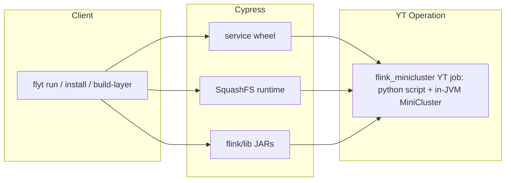
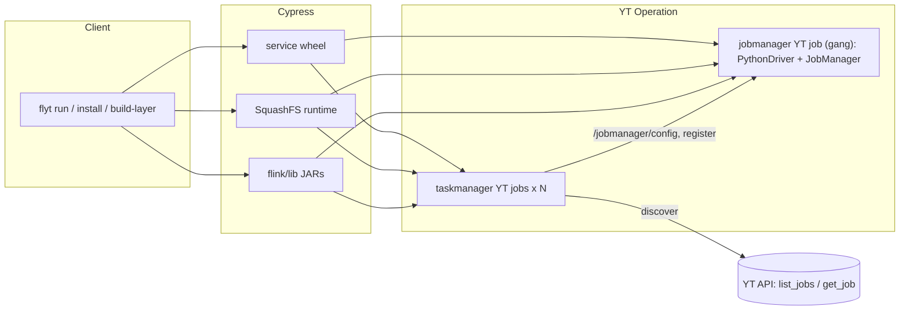
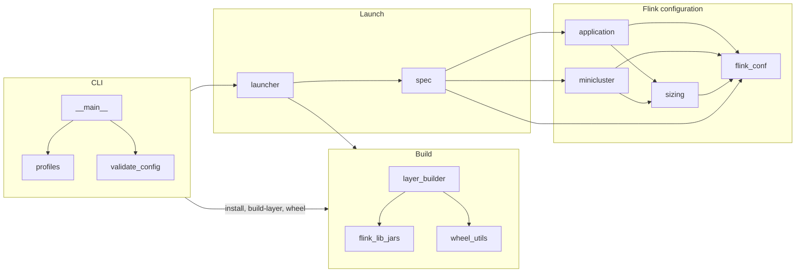

# Architecture

FLYT submits a PyFlink job as a YTsaurus Vanilla operation: one operation per pipeline, no shared cluster. The process builds an [operation spec](https://ytsaurus.tech/docs/ru/user-guide/data-processing/operations/vanilla#primer-specifikacii), uploads service wheels and JARs, and submits it via the YTsaurus client.

Two topologies (`cluster_mode`):

* `minicluster`: a single `flink_minicluster` task; the YT job runs the script through `flyt_minicluster.py`, which installs flyt's `config.yaml` as the context environment, and PyFlink starts an in-JVM MiniCluster. The job is one TaskManager: `minicluster/00_taskmanager_memory.sh` runs Flink's `BashJavaUtils` to turn `taskmanager.memory.*` into the JVM flags; when the script exits 0 the operation completes.
* `application`: a `jobmanager` task (one gang YT job) and a `taskmanager` task (`flyt.taskmanager.replicas` YT jobs). The JobManager YT job runs `standalone-job.sh --job-classname org.apache.flink.client.python.PythonDriver -py <script>`, i.e. Flink application mode with the PyFlink driver next to the JobManager JVM. The user guide is [docs/application-mode.md](docs/application-mode.md); the mechanics follow.

## Operation layout

#### minicluster
One YT job, PyFlink starts the MiniCluster inside the script's JVM.

```mermaid
flowchart LR
    subgraph Client
        A[flyt run / install / build-layer]
    end
    subgraph Cypress
        W[service wheel]
        R[SquashFS runtime]
        J[flink/lib JARs]
    end
    subgraph YT Operation
        V["flink_minicluster YT job: python script + in-JVM MiniCluster"]
    end
    A --> W & R & J
    W & R & J --> V
```

#### application
A gang JobManager YT job plus N TaskManager YT jobs that find it through the YT API.

```mermaid
flowchart LR
    subgraph Client
        A[flyt run / install / build-layer]
    end
    subgraph Cypress
        W[service wheel]
        R[SquashFS runtime]
        J[flink/lib JARs]
    end
    subgraph YT Operation
        JM["jobmanager YT job (gang): PythonDriver + JobManager"]
        TM["taskmanager YT jobs x N"]
    end
    API[(YT API: list_jobs / get_job)]
    A --> W & R & J
    W & R & J --> JM & TM
    TM -- discover --> API
    TM -- /jobmanager/config, register --> JM
```

## Application mode internals

#### YT resources
Resources are decided at submit time: `flyt.taskmanager.replicas` becomes the TaskManager YT job count, `flyt.taskmanager.cpu.cores` and `taskmanager.memory.process.size` every TaskManager's cpu, task slots and container memory, and the JobManager's by `flyt.jobmanager.cpu.cores` and `jobmanager.memory.process.size`. Every container is its Flink JVM's `*.memory.process.size`.

#### Configuration
The cluster configuration is one `config.yaml` generated by flyt and written into every YT job. Only per-container values travel on the command line: the JobManager's addresses, the TaskManager's host and resource id, and the discovered JobManager endpoint.

#### Discovery
TaskManagers find the JobManager through the YT API instead of a registry: `taskmanager` YT jobs lists the running `jobmanager` YT job of the same operation and incarnation, reads its addresses from YT, confirms through Flink's `/jobmanager/config` that the REST port belongs to that job (`flyt.yt.job-id`), and starts `taskmanager.sh` against the advertised RPC endpoint.

#### Lifecycle
The JobManager is a gang YT job, so its failure restarts the whole cluster with a new incarnation, while a TaskManager is restarted alone and the Flink job recovers through Flink's restart strategy. When the driver exits 0 (bounded sources, cancel or stop from the Web UI) the JobManager YT job completes the operation, so the operation ends instead of leaving TaskManagers waiting; a TaskManager that times out in discovery fails too, which eventually fails an operation whose JobManager never gets scheduled.

## Runtime and delivery

#### Profiles
Profiles encapsulate cluster proxy/pool, paths, layers, etc.; every profile key is a field of the launch configuration.

#### SquashFS runtime
The SquashFS runtime is built where you run `flyt` (Docker/Podman + `mksquashfs`), keyed by hash and cached on Cypress so exec nodes do not run `pip` per YT job. 

#### Delivery to YT jobs
[`layer_paths`](https://ytsaurus.tech/docs/en/user-guide/data-processing/operations/operations-options#user-script-options) — for production clusters (mount SquashFS on the node) — or `sandbox_unpack` — for local (Kind) clusters where porto support is not available (upload `.squashfs` as a file and unpack in the sandbox). 

#### Service wheel
Wheels in the layer target `runtime_python_version`; `python_bin` on workers must match that ABI.

#### JARs
List basenames in `embed_squashfs_layer_jar_basenames` (inside the layer) and/or `runtime_jar_basenames` (staged as [`file_paths`](https://ytsaurus.tech/docs/en/user-guide/data-processing/operations/operations-options#user-script-options) to `flink/lib`). Resolution picks the latest semver per basename under `jar_scan_folder`.

## Code layout

The code is split so the CLI, YTsaurus submission, and layer/image build logic can be tested independently. YT job bootstrap is concatenated bash from `run_scripts/`: `common/` prepares the sandbox for every role, then `minicluster/run.sh` or the `application/` fragments with one entry script per role (`jobmanager.sh`, `taskmanager.sh`). `sizing` sizes one TaskManager from the Flink configuration, `application` resolves the application cluster's YT resources from it, `minicluster` the MiniCluster job; each of them builds the `config.yaml` of its YT jobs from what `flink_conf` shares between the modes: flyt's defaults, the user's Flink configuration and the keys flyt owns.

```mermaid
graph LR
    subgraph cli[CLI]
        direction TB
        m[__main__] --> pr[profiles]
        m --> vc[validate_config]
    end
    subgraph build[Build]
        lb[layer_builder] --> jlib[flink_lib_jars]
        lb --> wu[wheel_utils]
    end
    subgraph conf[Flink configuration]
        app[application] --> sz[sizing]
        mc[minicluster] --> sz
        app & mc & sz --> fc[flink_conf]
    end
    subgraph launch[Launch]
        L[launcher] --> sp[spec]
    end
    cli --> L
    sp --> app & mc & fc
    cli -- install, build-layer, wheel --> build
    L --> build

```
Not drawn: `config` and `models`, used by almost every module; `ui_tracker` and `jobshell_resolve`, which find the Flink UI and the driver job of a running operation for `flyt run`, `flyt ui` and `flyt jobshell`; and the helpers `job_proxy` (the YT proxy of application-mode jobs), `yt_client`, `credentials`, `cli_helpers`, `container_runtime` and `jar_utils`; `__init__` only re-exports the public API.
